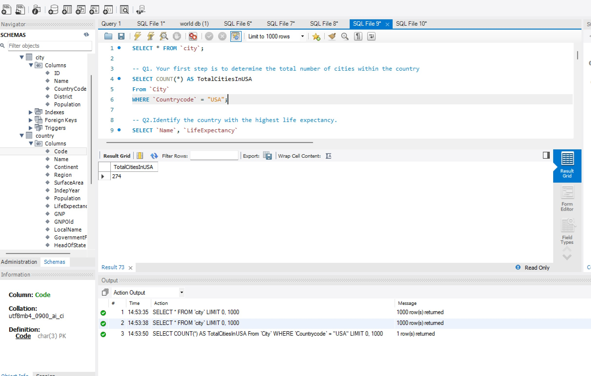
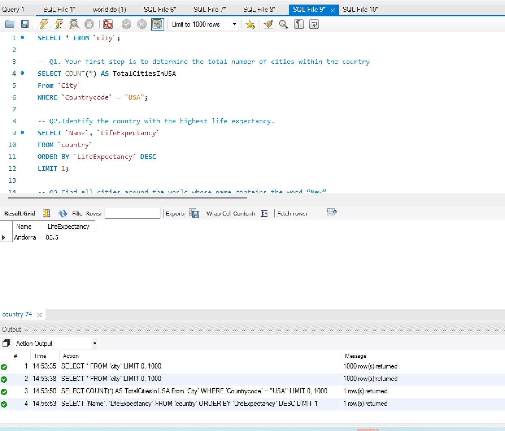
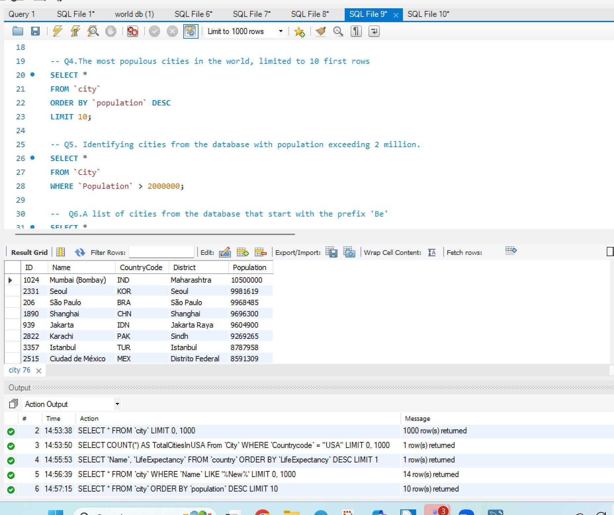
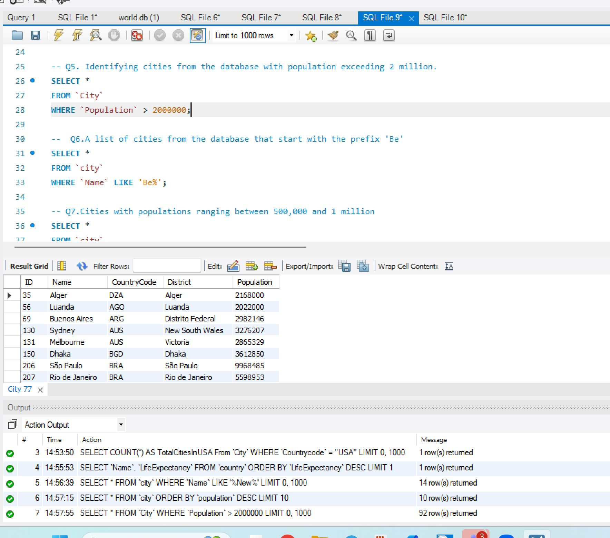
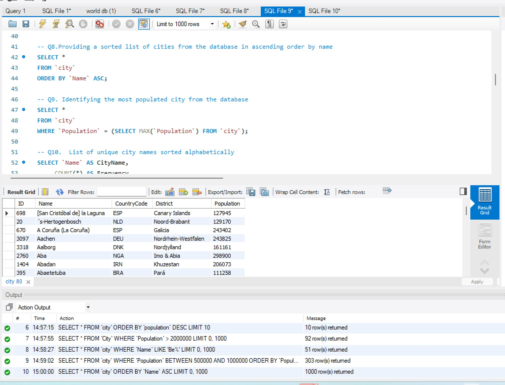
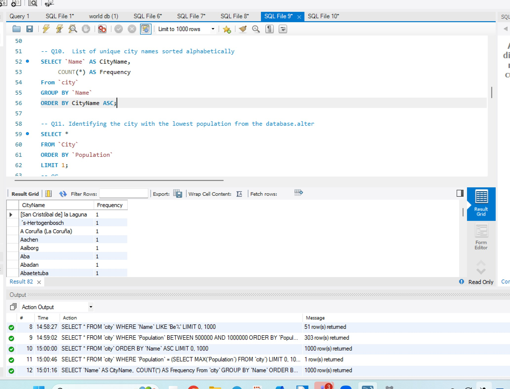
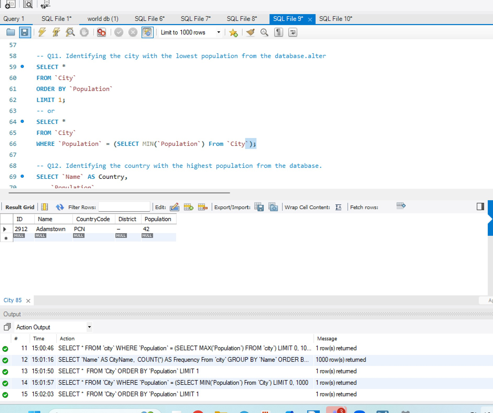
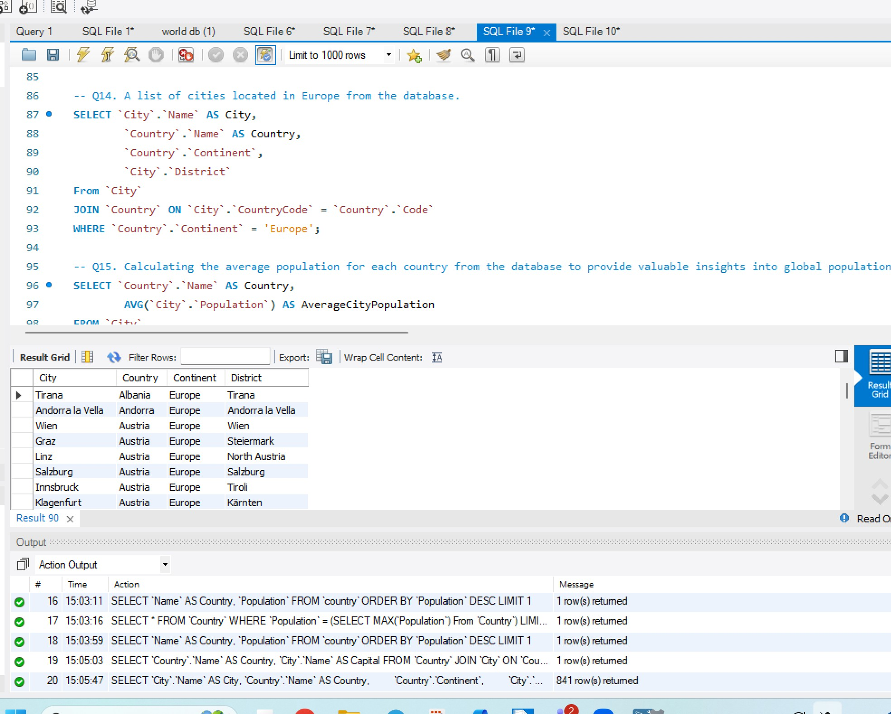
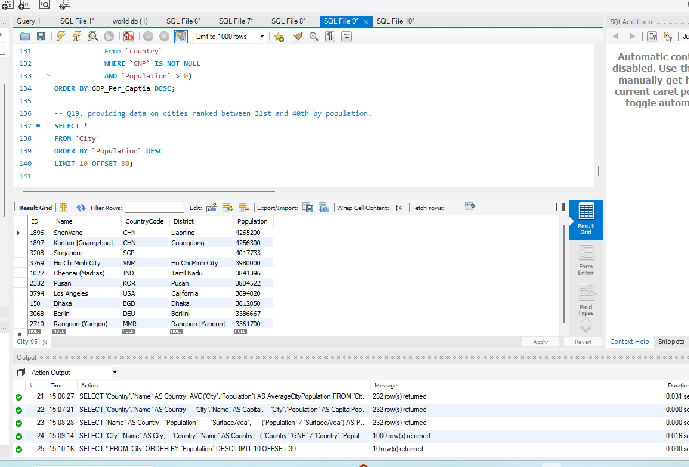

# World-db-SQL-Project
This project showcases 19 SQL queries using the **world_db** database in MySQL.  

---

This repository demonstrates structured SQL problem-solving, data analysis, and database querying.

## Project Contents
- **SQL Script contains all the syntax of the 19 questions**  
- **19+ screenshots of query results**  
- **Imported world db SQL database**  
- **README documentation**
  
---

## **SQL Questions & Output Screenshots**

Below are all questions with their related scenarios, SQL syntax, and output screenshots.

### **1. Count Cities in USA**

**Scenario:**  
Determine how many cities exist in the USA for a demographic baseline.

**SQL Syntax:** 
```SQL
SELECT COUNT(*) AS TotalCitiesInUSA
From `City`
WHERE `Countrycode` = "USA";
```

**Output Screenshot:**  



### **2. Country with the Highest Life Expectancy**

**Scenario:**  
Identify the country with the highest life expectancy for global health analysis.

**SQL Syntax:** 
```SQL
SELECT `Name`, `LifeExpectancy`
FROM `country`
ORDER BY `LifeExpectancy` DESC
LIMIT 1;
```

**Output Screenshot:**  



### **3. Cities Containing the Word “New”**

**Scenario:**  
Travel agency wants to promote cities with “New” in their names.

**SQL Syntax:** 
```SQL
SELECT *
FROM `city`
WHERE `Name` LIKE '%New%';
```

**Output Screenshot:**  


### **4. Display First 10 Cities by Population**

**Scenario:**  
Provide a brief overview of the world’s top 10 most populous cities.

**SQL Syntax:** 
```SQL
SELECT *
FROM `city`
ORDER BY `population` DESC
LIMIT 10;
```

**Output Screenshot:**  



### **5. Cities with Population > 2,000,000**

**Scenario:**  
The developer wants to focus on large-population cities for investment.

**SQL Syntax:** 
```SQL
SELECT *
FROM `City`
WHERE `Population` > 2000000;
```

**Output Screenshot:**  



### **6. Cities Beginning with "Be"**

**Scenario:**  
A travel blogger needs cities starting with the prefix "Be".

**SQL Syntax:** 
```SQL
SELECT *
FROM `city`
WHERE `Name` LIKE 'Be%';
```

**Output Screenshot:** 


### **7. Cities with Population Between 500,000 and 1,000,000**

**Scenario:**  
Urban planning committee researching mid-sized cities.

**SQL Syntax:** 
```SQL
SELECT *
FROM `city`
WHERE `Population` BETWEEN 500000 AND 1000000
ORDER BY `Population` DESC;
```

**Output Screenshot:** 


### **8. Cities Sorted Alphabetically (A–Z)**

**Scenario:**  
The geography teacher wants cities listed alphabetically.

**SQL Syntax:** 
```SQL
SELECT *
FROM `city`
ORDER BY `Name` ASC;
```

**Output Screenshot:** 



### **9. Most Populated City in the World**

**Scenario:**  
Investment firm researching the most populated global city.

**SQL Syntax:** 
```SQL
SELECT *
FROM `city`
WHERE `Population` = (SELECT MAX(`Population`) FROM `city`);
```

**Output Screenshot:** 


### **10. City Name Frequency Analysis**

**Scenario:**  
The teacher wants unique city names with their occurrence counts.

**SQL Syntax:** 
```SQL
SELECT `Name` AS CityName,
	 COUNT(*) AS Frequency
From `city`
GROUP BY `Name`
ORDER BY CityName ASC;
```

**Output Screenshot:** 



### **11. City with the Lowest Population**

**Scenario:**  
Census bureau analysing cities with the smallest populations.

**SQL Syntax (Method 1 - Order & Limit:** 
```SQL
SELECT * 
FROM `City`
ORDER BY `Population`
LIMIT 1;
```

**SQL Syntax (Method 2 - Using MIN Subquery:** 
```SQL
SELECT *
FROM `City`
WHERE `Population` = (SELECT MIN(`Population`) From `City`);
```

**Output Screenshot:**  



### **12. Country with Largest Population**

**Scenario:**  
Research institute analysing the world's highest population country.

**SQL Syntax (Method 1 - Order & Limit:** 
```SQL
SELECT `Name` AS Country,
	`Population`
FROM `country`
ORDER BY `Population` DESC
LIMIT 1;
```

**SQL Syntax (Method 2 - Using MAX Subquery:** 
```SQL
SELECT *
FROM `Country`
WHERE `Population` = (SELECT MAX(`Population`) From `Country`);
```

**Output Screenshots:**  
  


### **13. Capital of Spain**

**Scenario:**  
The travel agency needs accurate capital city for Spain.

**SQL Syntax:** 
```SQL
SELECT `Country`.`Name` AS Country,
		`City`.`Name` AS Capital
FROM `Country`
JOIN `City` ON `Country`.`Capital` = `City`.`ID`
WHERE `Country`.`Name` = 'Spain';
```

**Output Screenshot:**  


### **14. Cities in Europe**

**Scenario:**  
The cultural exchange program needs a list of European cities.

**SQL Syntax:** 
```SQL
SELECT `City`.`Name` AS City,
		`Country`.`Name` AS Country,
        `Country`.`Continent`,
        `City`.`District`
From `City`
JOIN `Country` ON `City`.`CountryCode` = `Country`.`Code`
WHERE `Country`.`Continent` = 'Europe';
```

**Output Screenshot:**    



### **15. Average Population by Country**

**Scenario:**  
Research team analysing population averages globally.

**SQL Syntax:** 
```SQL
SELECT `Country`.`Name` AS Country,
		AVG(`City`.`Population`) AS AverageCityPopulation
FROM `City`
JOIN `Country` ON `City`.`CountryCode` = `Country`.`Code`
GROUP BY `Country`.`Name`
ORDER BY AverageCityPopulation DESC;
```

**Output Screenshot:**   


### **16. Capital Cities Population Comparison**

**Scenario:**  
Statistical firm comparing populations of worldwide capitals.

**SQL Syntax:** 
```SQL
SELECT `Country`.`Name` AS Country,
	   `City`.`Name` AS Capital,
	   `City`.`Population` AS CapitalPopulation
FROM `Country`
JOIN `City` ON `Country`.`Capital` = `City`.`ID`
ORDER BY `City`.`Population` DESC;
```

**Output Screenshot:**   


### **17. Countries with Low Population Density**

**Scenario:**  
An agricultural research institute studying low-density countries.

**SQL Syntax:** 
```SQL
SELECT `Name` AS Country, 
	`Population`, 
    `SurfaceArea`, 
    (`Population` / `SurfaceArea`) AS PopulationDensity
From `Country` 
WHERE `Population` > 0 
ORDER BY PopulationDensity ASC;
```

**Output Screenshot:**   


### **18. Cities with High GDP per Capita**

**Scenario:**  
Economic consulting firm researching wealthy cities.

**SQL Syntax:** 
```SQL
-- GDP per capita = Total GDP / Total Population
SELECT `City`.`Name` AS City,
	   `Country`.`Name` AS Country, 
	 ( `Country`.`GNP` / `Country`.`Population`) AS GDP_Per_Captia
From `City`
JOIN `Country` on `City`.`CountryCode` = `Country`.`Code`
WHERE `Country`.`GNP` IS NOT NULL
	AND `Country`.`Population` > 0 
	AND ( `Country`.`GNP` / `Country`.`Population` ) > ( SELECT AVG( `GNP` / `Population` ) 
			From `country` 
			WHERE `GNP` IS NOT NULL 
			AND `Population` > 0)
ORDER BY GDP_Per_Captia DESC;
```

**Output Screenshot:**   


### **19. Cities Ranked 31–40 by Population**

**Scenario:**  
Market research firm analysing mid-ranked global cities.

**SQL Syntax:** 
```SQL
SELECT *
FROM `City`
ORDER BY `Population` DESC
LIMIT 10 OFFSET 30;
```

**Output Screenshot:**  



